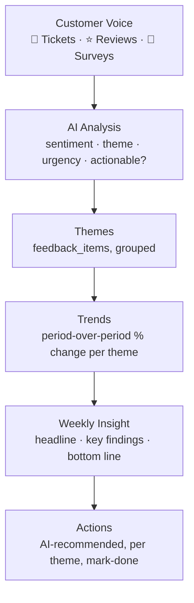
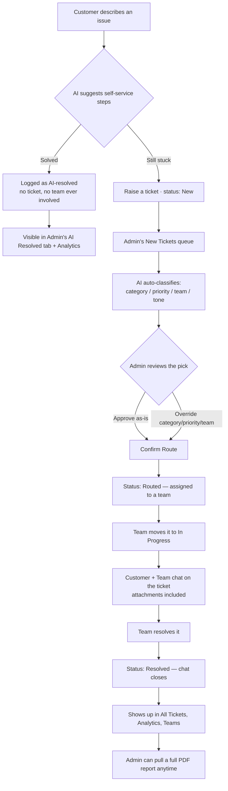

#  TicketTrident – Route Smarter. Resolve Faster.

An AI-powered support ticket platform. A customer describes an issue; AI tries to resolve it on the spot with concrete steps, and only becomes a real ticket — classified into **category, priority, team, tone, and a one-line reason** as strict, schema-validated JSON — if that isn't enough. Four account types (Customer, Team, Admin, Product Manager) each get their own dashboard, and a customer and their assigned team can message each other, attachments included, right on the ticket. Every piece of customer voice — tickets, imported reviews, and quick surveys alike — also feeds a separate PM dashboard that tracks sentiment, themes, and trends over time, and generates plain-language weekly/monthly reports with recommended actions.

Built for **Port·04 — The Senate of Gods**.

---

## Why this exists

Support teams drown in tickets because triage is repetitive, low-judgment work that still requires reading and context. That's exactly the profile of task an LLM is good at: it reads the message, understands intent (including sarcasm, negation, and multi-issue tickets a keyword filter can't), and returns a structured decision in under two seconds.


## What's actually in the app

Four account types, each with their own login and dashboard:

### Customer
- Describes an issue in plain language — **AI tries to resolve it immediately**, suggesting concrete steps before any ticket is created. If that's not enough, one click ("Still not solved — raise a ticket") files a real ticket; if it helped ("That solved it"), no ticket is ever created — the case is just logged as AI-resolved so an Admin can still see it.
- Tracks their own tickets and status (In queue → Assigned → In Progress → Resolved).
- Once a ticket is **In Progress**, can message the assigned team directly on that ticket, attachments included — closed again once it's Resolved.

### Team member
- Account created by an Admin (who sets the password directly — no auto-generated password to relay), scoped to one team.
- Works only their own team's queue; status only moves forward (Routed → In Progress → Resolved, never back).
- Chats with the customer on any ticket they're actively working, with an unread-message badge.
- Self-service password reset via a time-limited emailed link.

### Admin
- **New Tickets queue**: every incoming ticket is classified by AI automatically the moment it's seen — no manual "route" click. Review the AI's pick (or override category/priority/team), select any number, and "Confirm Route" assigns them all at once.
- **All Tickets**: every ticket ever submitted, filterable by status and by team (dropdown), searchable by ID/customer name/message text, with a read-only view into each ticket's chat history and a one-click **PDF report** per ticket.
- **AI Resolved**: every case where AI's self-service suggestion solved the customer's issue before a ticket ever existed — a running total, searchable by customer/message, sortable by date — visibility into deflected volume that would otherwise never show up anywhere.
- **Teams**: workload summary (total/assigned/in-progress/resolved) across every team that actually exists in this deployment, plus a PDF export.
- **Team Members**: create/remove team accounts.
- **Manual vs AI Race**: pick a ticket, triage it yourself with a real stopwatch, then let AI classify the same ticket — a genuine measured comparison, not an assumed number.
- **Demo**: routes all 30 bundled sample tickets in one pass.
- **Analytics**: tickets routed vs. resolved by AI (with a deflection-rate callout), tickets generated over time, AI vs. manual time (clearly labeled as measured vs. assumed), status/priority/category/team/tone breakdowns, ambiguity/escalation/agreement stats — exportable as a PDF.

### Product Manager

A separate account type and dashboard — same shape as Admin (a single fixed login, no signup, not something Admin creates or manages), but a completely different lens on the same customer voice:

- **Overview**: source breakdown (tickets / reviews / surveys), a sentiment-distribution chart, and avg sentiment/urgency/actionable-count stats for the current week.
- **Themes & Trends**: theme frequency chart plus period-over-period deltas per theme (new/up/down/resolved, with the actual % change), filterable by day/week/month/year.
- **Reports & Actions**: a persisted, plain-language report per period (headline, key findings, narrative, bottom line) generated on demand, plus AI-recommended actions per worsening/urgent theme with a mark-done toggle.
- **Import Feedback**: paste-a-batch import for external reviews or survey exports — the only way that kind of customer voice enters the system, since there's no other product surface for it.

See **[Customer feedback insights](#customer-feedback-insights-pulseai)** below for how the pipeline behind this actually works.

---

## Per-ticket PDF reports

Beyond the Analytics and Teams PDF exports, an Admin can generate a full report for any single ticket: its details, who's handled it, and the entire chat transcript — with every attachment rendered as its own page in the same PDF. Images get embedded directly; an uploaded PDF has its actual pages merged straight in (not just linked); text and Word documents get their content extracted and typeset as a page. Built with `reportlab` + `pypdf`, entirely in memory.

---

## Customer feedback insights (PulseAI)



Every ticket a customer submits is mirrored into a `feedback_items` table alongside imported reviews and quick surveys — one unified log, regardless of source. `feedback_ai.py` analyzes each item independently of ticket routing (a ticket still gets category/priority/team from `classifier.py` exactly as before); `insights.py` aggregates that log into daily/weekly/monthly/yearly buckets and computes trend deltas; `actions_ai.py` and `narrative_ai.py` turn those aggregates into recommended actions and a persisted plain-language report. None of this ever touches raw customer text once it reaches the aggregation stage — only the numbers `feedback_ai.py` already produced at ingestion time.

### Taxonomy

| Field | Values | Notes |
|---|---|---|
| `sentiment_label` | positive / neutral / negative / mixed | Judged from the words used, not the topic — a calm question about a serious-sounding topic is neutral, not negative. |
| `sentiment_score` | -1.0 to 1.0 | A finer-grained companion to the label; must agree with it (never a negative label with a positive score). |
| `theme` | free text, 2-4 words | Deliberately **not** a fixed enum. An enum forces every real-world issue into one of N buckets chosen in advance; free text lets "checkout latency" and "duplicate billing charge" exist as their own specific labels instead of collapsing into a generic "Technical Issue" or "Billing" bucket. The cost of that choice is consistency — see **Known limitations** below. |
| `urgency_score` | 0.0 to 1.0 | Driven by severity/business impact (data loss, security, outage, churn risk) — not by politeness or exclamation points. |
| `is_actionable_ticket` | boolean | True only if a human/team genuinely needs to *do* something — a real bug, billing dispute, security concern, or support request. False for praise, general venting with no ask, or a question answerable by self-service docs. |

### Why these few-shot examples

Each AI call in the pipeline (`feedback_ai.py`, `actions_ai.py`, `narrative_ai.py`) ships 2-4 worked examples chosen to mark the edges of the judgment space, not to hand the model a lookup table:

- **`feedback_ai.py`** (sentiment/theme/urgency/actionable): a negative-and-actionable case, a positive-but-not-actionable case (praise with nothing to act on), a mixed-sentiment case (genuine praise *and* a real defect in one message), and the vague/near-empty edge case. Those four cover the distinctions most likely to get confused — "negative" doesn't imply "actionable," and "actionable" doesn't require negativity.
- **`actions_ai.py`** (recommended actions): one high-severity example (escalate now) and one low-severity example (log for later, no escalation) — calibrating that the *intensity* of the recommended action should track the data's severity, not treat every flagged theme as equally urgent.
- **`narrative_ai.py`** (periodic report): one sharply-worsening period and one calm, stable period — so the model has seen both a report that should sound urgent and one that should plainly say "no action needed" rather than manufacturing urgency that isn't in the numbers.

### Accuracy

`python -m app.cli eval-feedback` runs `feedback_ai.analyze_feedback` against 16 hand-labeled samples in `sample_feedback.py` — spanning all four sentiment labels, actionable and non-actionable cases, sarcasm, a non-English message, and the empty-input edge case — and grades sentiment (exact match), `is_actionable_ticket` (exact match), and theme (does the generated theme contain one of a few acceptable keywords, since themes are free text by design). A real run against the live model:

| Dimension | Accuracy |
|---|---|
| Sentiment | 100.0% |
| Actionable | 93.8% |
| Theme | 100.0% |
| All three correct | 93.8% |

The one disagreement: a calm "does my plan auto-renew?" question was labeled `is_actionable_ticket=true` in the ground truth (something a human should confirm) but the model called it `false` (answerable by self-service docs, no team action needed) — a genuinely defensible judgment call in either direction, not a clear-cut miss.

### Known limitations

- **Theme fragmentation.** Because themes are free text, two near-duplicate complaints ("checkout is slow" / "checkout takes forever") can land as slightly different theme strings ("checkout latency" vs. "slow checkout process") instead of merging into one bucket — inflating the apparent number of distinct themes and splitting what should be one trend line into two smaller ones.
- **Occasional arithmetic slip in the narrative report.** In one manual test, the generated report's key findings stated "all 4 items were negative" when the actual breakdown (given directly to the model in the prompt) was 3 negative and 1 positive — a real but isolated instance of the model misreading numbers it was handed rather than reasoning about raw text.
- **`is_actionable_ticket` has real judgment-call territory**, as the eval above shows — informational questions that could go either way (self-service vs. needs a human) are the likely failure mode a mentor's blind test would surface.
- **Only lightly tested on non-English input** (one Spanish example in the eval set) and on deliberate adversarial phrasing beyond a single sarcasm case — a wider multilingual/adversarial sample would give a more confident accuracy number there.
- **The eval above ran against whichever single provider is configured** (OpenAI in this deployment) — it doesn't measure whether accuracy holds across Claude/Groq as well, the way `--compare` does for ticket classification.

---

## Quick start

### 1. Backend (FastAPI)

```bash
cd backend
python3 -m venv .venv && source .venv/bin/activate
pip install -r requirements.txt
cp .env.example .env        # fill in DATABASE_URL (required) + a provider key (optional)
uvicorn app.main:app --reload --port 8000
```

`DATABASE_URL` is the one required setting — a Postgres connection string. With [Supabase](https://supabase.com): create a free project, then **Project Settings → Database → Connection string → URI**, and use the "Session" pooler string (port 5432) for this app's single long-running process. Any Postgres works, including a local one for dev (`createdb tickettrident && DATABASE_URL=postgresql://localhost/tickettrident`).

### 2. Frontend (React + Vite)

```bash
cd frontend
npm install
npm run dev
```

Open **http://localhost:5173**. Vite proxies `/api/*` to the backend on port 8000 in dev.

### One command for both

```bash
./dev.sh
```

### Single-server "production" mode

```bash
cd frontend && npm run build && cd ..
cd backend && source .venv/bin/activate && uvicorn app.main:app --port 8000
```

FastAPI detects `frontend/dist` and serves the built UI directly from `http://localhost:8000/` — one process, one port, nothing else running.

### CLI

```bash
cd backend && source .venv/bin/activate
python -m app.cli route "I was charged twice and support has ignored me for a week!!"
python -m app.cli route "I was charged twice" --compare   # + keyword baseline side by side
python -m app.cli demo                                     # routes all 30 sample tickets
python -m app.cli eval-feedback                             # accuracy over the hand-labeled feedback sample set
python -m app.cli health                                   # live vs mock mode, current model
```

---

## Tech stack & why

| Layer | Choice | Why |
|---|---|---|
| LLM | OpenAI - Structured Outputs / JSON Schema on each | JSON Schema enforcement at the API level, not a prompt convention. 
| Backend | FastAPI + Pydantic | Schema-first by default; the same Pydantic models that validate an LLM's output also generate the OpenAPI docs. |
| Auth | PyJWT + bcrypt | Stateless JWTs carrying role (`user`/`team`/`admin`) and identity; bcrypt-hashed passwords, never stored or logged in plaintext. |
| Storage | Postgres (Supabase) via `psycopg` | Real persistence and a full audit trail — tickets, users, team members, chat messages, and attachment bytes — with a managed host that survives restarts/redeploys and supports more than one backend process. |
| PDF generation | `reportlab` + `pypdf` (backend, per-ticket reports); `jsPDF` + `jspdf-autotable` (frontend, Analytics/Teams exports) | Per-ticket reports need to merge real pages from arbitrary uploaded PDFs and embed images — a proper PDF library, not just a print-to-PDF trick. |
| Frontend | React + JavaScript + Vite + React Router | Fast dev loop with no build-time type layer; three role-gated route trees (`/user`, `/team`, `/admin`). |
| Styling | Tailwind CSS v4 | Design tokens (`@theme`) keep light/dark and priority/tone/status colors consistent across every component without a component library dependency. |
| Charts | Recharts | Composable, React-native chart primitives for the analytics dashboard. |

---

## Workflow

How one issue actually moves through the system, end to end:



1. **Customer describes an issue.** No ticket exists yet — AI reads it and suggests concrete steps to try immediately.
2. **Solved?** If so, no ticket is ever created — the case is logged separately as AI-resolved, so an Admin can still see it in the **AI Resolved** tab and in Analytics' deflection-rate stats.
3. **Still stuck** → one click ("raise a ticket") actually creates it, with status `New` and no classification yet.
4. **Admin's New Tickets queue** picks it up automatically — every ticket there gets classified by AI (category, priority, team, tone, confidence, one-line reasoning) the moment it's seen, no manual "route" click required.
5. **Admin reviews** the AI's pick — approve it as-is, or override category/priority/team — then selects any number of reviewed tickets and hits **Confirm Route**, which assigns them all at once. Status moves to `Routed`.
6. **The assigned team** picks it up from their own queue and moves it to `In Progress`.
7. **Once In Progress**, the customer and that team can message each other directly on the ticket, attachments included — this is enforced server-side, not just hidden in the UI.
8. **The team resolves it** → status `Resolved`, and the chat closes on both sides.
9. **From here it's just visible**, everywhere an Admin looks: All Tickets, the Teams workload summary, and Analytics — and an Admin can generate a full PDF report for that one ticket at any point, transcript and attachments included.

---

## Screenshots

### Getting started

**Sign in**
Three account types — Customer, Team, and Admin — each with their own login on one page.


### Customer

**Describe an issue**
The customer describes a problem in plain language; AI tries to help before any ticket exists.


**AI suggests steps to try**
AI returns concrete self-service steps and a summary — from here the customer confirms it worked or raises a ticket anyway.


**Resolved by AI**
Every issue AI solved on the spot is logged here, with the exact steps that fixed it — no ticket, no team ever involved.


**AI defers to a human**
For a genuine billing dispute, AI recognizes it should be handled by a person and points straight to raising a ticket instead of guessing.


**A freshly raised ticket**
Right after raising a ticket it shows status "In queue", waiting for an admin to review the AI's routing.


**Tracking a ticket to resolution**
The status stepper shows a ticket's full journey from In queue to Resolved.


**New reply from the team**
An unread-message badge on "Message team" tells the customer their assigned team just replied.


**Chatting with the team**
Customer and team message each other directly on the ticket once it's In Progress, right through to resolution.


### Team member

**Replying to a customer**
A team member opens a ticket's chat thread to ask for more detail before working the issue.


**Marking a ticket resolved**
Once the issue is fixed, the team moves the ticket to Resolved, closing the chat on both sides.


### Admin

**AI's classification, up close**
Category, priority, team, tone, and confidence for one ticket, plus the naive keyword baseline shown for comparison.


**New Tickets queue**
Every incoming ticket is classified automatically the moment it's seen; select any number and Confirm Route to assign them all at once.


**All Tickets**
Every ticket ever submitted, filterable by status and by team, searchable by ID, name, or message.


**Reading a ticket's chat history**
An admin gets a read-only view into any ticket's full conversation, without being able to reply.


**Filtered to Resolved**
The same All Tickets table, narrowed instantly to just the resolved ones.


**AI Resolved, across every customer**
Every case where a customer's issue was closed out by AI on its own, with a running total and the exact steps it suggested.


**Team workload**
Assigned / in-progress / resolved counts for every team that actually exists in this deployment.


**Managing team accounts**
An admin creates a login for a support team member, scoped to exactly one team.


**Manual vs AI — timing yourself**
An admin classifies a real ticket by hand with a stopwatch running, before letting AI take the exact same ticket.


**Manual vs AI — the result**
A genuine, measured comparison — here AI was 6x faster than manual triage on the same ticket.


**Demo: 30 sample tickets**
One click routes the full bundled demo set, spanning every tone, priority, and team.


**Demo results**
Every one of the 30 sample tickets routed, with category, priority, team, tone, and confidence for each.


**Analytics**
Tickets routed vs. resolved by AI, time saved, tickets over time, and every breakdown in one dashboard.


**Analytics, exported**
The same numbers as a shareable PDF report, one click away from the dashboard.


**A single ticket's full story**
Details, the entire chat transcript, and every attachment merged into one PDF report.


