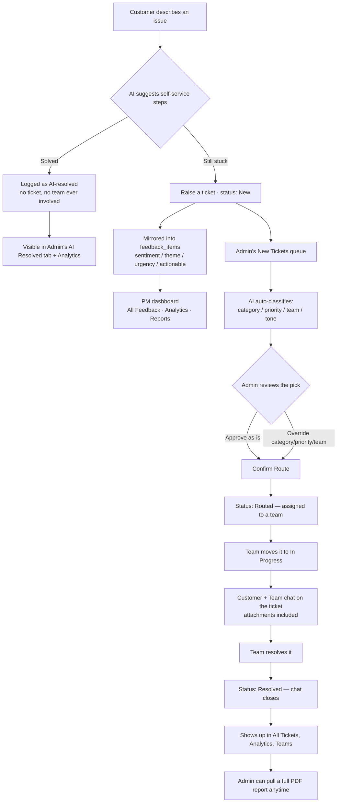
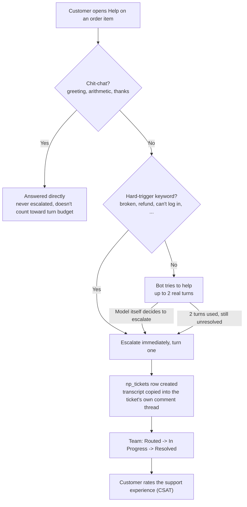

#  TicketTrident – Route Smarter. Resolve Faster.

An AI-powered support ticket platform. A customer describes an issue; AI tries to resolve it on the spot with concrete steps, and only becomes a real ticket — classified into **category, priority, team, tone, and a one-line reason** as strict, schema-validated JSON — if that isn't enough. Four account types (Customer, Team, Admin, Product Manager) each get their own dashboard, and a customer and their assigned team can message each other, attachments included, right on the ticket. Every piece of customer voice — tickets, imported reviews, and quick surveys alike — also feeds a separate PM dashboard that tracks sentiment, themes, and trends over time, and generates plain-language weekly/monthly reports with recommended actions.

The same app also runs a second, self-contained product: **[Nykaa Pulse](#nykaa-pulse)** — a cosmetics-e-commerce storefront and feedback loop (catalog, orders, reviews, beauty profiles, its own support-ticket flow) reachable via a "Nykaa Pulse" mega-tab right next to "TicketTrident" on every one of the four dashboards. Same login, same account, two products, same AI pipelines proving themselves against a structurally different domain.

Built for **Port·04 — The Senate of Gods**.

---

## Problem statement

Support teams drown in tickets because triage is repetitive, low-judgment work that still requires reading and context. That's exactly the profile of task an LLM is good at: it reads the message, understands intent (including sarcasm, negation, and multi-issue tickets a keyword filter can't), and returns a structured decision in under two seconds.

---

## Workflow

How one issue actually moves through the system, end to end:



1. **Customer describes an issue.** No ticket exists yet — AI reads it and suggests concrete steps to try immediately.
2. **Solved?** If so, no ticket is ever created — the case is logged separately as AI-resolved, so an Admin can still see it in the **AI Resolved** tab and in Analytics' deflection-rate stats.
3. **Still stuck** → one click ("raise a ticket") actually creates it, with status `New` and no classification yet.
4. **In parallel, the ticket is mirrored into `feedback_items`** — AI independently analyzes sentiment, theme, urgency, and actionability, feeding the PM dashboard's All Feedback, Analytics, and Reports tabs regardless of how (or whether) the ticket ever gets routed.
5. **Admin's New Tickets queue** picks it up automatically — every ticket there gets classified by AI (category, priority, team, tone, confidence, one-line reasoning) the moment it's seen, no manual "route" click required.
6. **Admin reviews** the AI's pick — approve it as-is, or override category/priority/team — then selects any number of reviewed tickets and hits **Confirm Route**, which assigns them all at once. Status moves to `Routed`.
7. **The assigned team** picks it up from their own queue and moves it to `In Progress`.
8. **Once In Progress**, the customer and that team can message each other directly on the ticket, attachments included — this is enforced server-side, not just hidden in the UI.
9. **The team resolves it** → status `Resolved`, and the chat closes on both sides.
10. **From here it's just visible**, everywhere an Admin looks: All Tickets, the Teams workload summary, and Analytics — and an Admin can generate a full PDF report for that one ticket at any point, transcript and attachments included.

---

## User functions

Four account types, each with their own login and dashboard. Every dashboard below also carries a second "Nykaa Pulse" mega-tab alongside "TicketTrident" — see **[Nykaa Pulse](#nykaa-pulse)** further down for what lives there.

### Customer
- Describes an issue in plain language — **AI tries to resolve it immediately**, suggesting concrete steps before any ticket is created. If that's not enough, one click ("Still not solved — raise a ticket") files a real ticket; if it helped ("That solved it"), no ticket is ever created — the case is just logged as AI-resolved so an Admin can still see it.
- Tracks their own tickets and status (In queue → Assigned → In Progress → Resolved).
- Once a ticket is **In Progress**, can message the assigned team directly on that ticket, attachments included — closed again once it's Resolved.

### Team member
- Account created by an Admin (who sets the password directly — no auto-generated password to relay), scoped to one team.
- Works only their own team's queue; status only moves forward (Routed → In Progress → Resolved, never back).
- Chats with the customer on any ticket they're actively working, with an unread-message badge.
- Self-service password reset via a time-limited emailed link.

### Admin
- **New Tickets queue**: every incoming ticket is classified by AI automatically the moment it's seen — no manual "route" click. Review the AI's pick (or override category/priority/team), select any number, and "Confirm Route" assigns them all at once.
- **All Tickets**: every ticket ever submitted, filterable by status and by team (dropdown), searchable by ID/customer name/message text, with a read-only view into each ticket's chat history and a one-click **PDF report** per ticket.
- **AI Resolved**: every case where AI's self-service suggestion solved the customer's issue before a ticket ever existed — a running total, searchable by customer/message, sortable by date — visibility into deflected volume that would otherwise never show up anywhere.
- **Teams**: workload summary (total/assigned/in-progress/resolved) across every team that actually exists in this deployment, plus a PDF export.
- **Team Members**: create/remove team accounts.
- **Manual vs AI Race**: pick a ticket, triage it yourself with a real stopwatch, then let AI classify the same ticket — a genuine measured comparison, not an assumed number.
- **Demo**: routes all 30 bundled sample tickets in one pass.
- **Analytics**: tickets routed vs. resolved by AI (with a deflection-rate callout), tickets generated over time, AI vs. manual time (clearly labeled as measured vs. assumed), status/priority/category/team/tone breakdowns, ambiguity/escalation/agreement stats — exportable as a PDF.

### Product Manager

A separate account type and dashboard — same shape as Admin (a single fixed login, no signup, not something Admin creates or manages), but a completely different lens on the same customer voice. Five tabs:

- **All Feedback**: every ticket, review, and survey response ever logged, in one searchable, period-filterable table — sentiment, category, theme, urgency, and actionable status alongside the raw text.
- **Analytics**: a category-volume chart, a "themes within [category]" drill-down (pick any category, see its top themes), a sentiment donut, star-rating distribution, and urgency/actionable breakdowns — filterable by day/week/month/year/custom range, exportable as a PDF.
- **Reports**: a persisted weekly/monthly/yearly report per period, generated on demand — point-wise bullets (not paragraphs) for the narrative, what's going well, the top pain point, and the recommendation — plus AI-recommended actions per worsening/urgent theme with a mark-done toggle, all exportable together as one PDF alongside the period's raw feedback items.
- **Create Survey**: write your own multi-question survey (a fixed 5-point Worst→Best scale) and send it to every customer account at once.
- **Survey Analytics**: response-type and rating-distribution charts, either for one sent survey or pooled across every survey sent, exportable as a PDF.

---

## Nykaa Pulse

A second, self-contained product living in the same app: a cosmetics-e-commerce storefront and feedback loop, built to put the same AI pipelines (sentiment/urgency analysis, ticket classification, PDF reporting) through a structurally different domain than TicketTrident's raw support tickets. Reachable via a "Nykaa Pulse" mega-tab right next to "TicketTrident" on every one of the four dashboards — same login, same account, two products.

### Workflow

How a Nykaa Pulse support case moves from a customer's question to a resolved ticket:



1. **Customer opens Help** on an order item — pure chit-chat (greetings, thanks, arithmetic) is answered directly; it's never escalated and doesn't count toward the turn budget.
2. **A hard-trigger keyword** (broken, refund, can't log in, etc.) escalates immediately, on the very first real turn.
3. **Otherwise, the bot tries to help** for up to 2 real turns — if the model itself decides to escalate, or the 2 turns run out with the issue still unresolved, it escalates the same way.
4. **Escalating creates an `np_tickets` row**, with the full chat transcript copied straight into the ticket's own comment thread — nothing is lost switching from bot to human.
5. **The team works it** the same way as TicketTrident: Routed → In Progress → Resolved.
6. **The customer rates the support experience** (CSAT) once it's resolved.

Separately: a product review the AI judges genuinely actionable auto-opens a ticket on the customer's behalf — tagged "Auto-flagged from a review" — so a customer never has to separately click "Raise a Ticket" for a problem they just described in a review.

### Customer

Everything lives on one page under the "Nykaa Pulse" mega-tab:
- **Storefront**: search, category/brand/subcategory filters, a product grid where every card expands into an AI-written "What customers say" panel (fit summary, praise/concern chips, an "ask about this product" Q&A box grounded only in that product's own reviews).
- **Cart & checkout** via a slide-over drawer.
- **My Orders**: per-item **Feedback** (star rating → theme chips drawn from that exact product's own tags → free text → an optional review title, with a "Generate" button or left blank for an automatic one) and **Delivery Feedback** (5-star + compliment).
- **Beauty Profile**: a Skin/Hair/Makeup wizard that unlocks personalized recommendations and a one-click AI-generated skincare + haircare routine, one real product per step with a one-sentence reason why it fits.
- **"Raise a Ticket" support chat**, opened per order item.
- A floating **App Feedback** widget (rate the app itself, pick from fixed issue categories — multi-select — plus free text; no AI involved, reachable even logged out from the login page) and a shared pending-survey nudge (the same PM-authored surveys TicketTrident customers get).

### Team & Admin

Both dashboards get the same "Nykaa Pulse" mega-tab:
- **Team**: their own `np_tickets` queue (Routed → In Progress → Resolved, chat once In Progress) plus an AI Resolved log of bot-only conversations that never escalated.
- **Admin**: full ticket oversight across every team (status/team filters, search, sort, read-only chat history, per-ticket PDF export), the same AI Resolved log, a per-team ticket-count rollup, team-lead account management, and an Analytics tab (tickets over time, status/priority/category/team/tone breakdowns, AI-resolved-vs-routed).

### Product Manager

Eight tabs: **Overview** (order/GMV/rating stat tiles, the order → review → photo → published drop-off funnel, review-sentiment donut), **All Feedback** (the raw, filterable review log), **Analytics** (cross-brand comparison — feedback volume by brand, top-5 themes within a picked brand, multi-brand volume/sentiment trend lines, a per-year brand rating chart with star-symbol labels, category/subcategory rankings, positive/negative/recurring themes — or drill into one brand for its own full breakdown), **App Feedback** and **Delivery Feedback** (aggregate-only rating/category breakdowns, no raw text), **Reports** (a weekly/monthly/yearly brand insight report — plain-language bullets, not paragraphs — with its own PDF export), and **Create Survey** / **Survey Analytics** — shared verbatim with TicketTrident, since a PM's surveys go to every customer regardless of which product they're browsing.

---

## Tech stack & why

| Layer | Choice | Why |
|---|---|---|
| LLM | OpenAI - Structured Outputs / JSON Schema on each | JSON Schema enforcement at the API level, not a prompt convention. 
| Backend | FastAPI + Pydantic | Schema-first by default; the same Pydantic models that validate an LLM's output also generate the OpenAPI docs. |
| Auth | PyJWT + bcrypt | Stateless JWTs carrying role (`user`/`team`/`admin`) and identity; bcrypt-hashed passwords, never stored or logged in plaintext. |
| Storage | Postgres (Supabase) via `psycopg` | Real persistence and a full audit trail — tickets, users, team members, chat messages, and attachment bytes — with a managed host that survives restarts/redeploys and supports more than one backend process. |
| PDF generation | `reportlab` + `pypdf` (backend, per-ticket reports); `jsPDF` + `jspdf-autotable` (frontend, Analytics/Teams exports) | Per-ticket reports need to merge real pages from arbitrary uploaded PDFs and embed images — a proper PDF library, not just a print-to-PDF trick. |
| Frontend | React + JavaScript + Vite + React Router | Fast dev loop with no build-time type layer; three role-gated route trees (`/user`, `/team`, `/admin`). |
| Styling | Tailwind CSS v4 | Design tokens (`@theme`) keep light/dark and priority/tone/status colors consistent across every component without a component library dependency. |
| Charts | Recharts | Composable, React-native chart primitives for the analytics dashboard. |

---

## How to run

### 1. Backend (FastAPI)

```bash
cd backend
python3 -m venv .venv && source .venv/bin/activate
pip install -r requirements.txt
cp .env.example .env        # fill in DATABASE_URL (required) + a provider key (optional)
uvicorn app.main:app --reload --port 8000
```

`DATABASE_URL` is the one required setting — a Postgres connection string. With [Supabase](https://supabase.com): create a free project, then **Project Settings → Database → Connection string → URI**, and use the "Session" pooler string (port 5432) for this app's single long-running process. Any Postgres works, including a local one for dev (`createdb tickettrident && DATABASE_URL=postgresql://localhost/tickettrident`).

### 2. Frontend (React + Vite)

```bash
cd frontend
npm install
npm run dev
```

Open **http://localhost:5173**. Vite proxies `/api/*` to the backend on port 8000 in dev.

### One command for both

```bash
./dev.sh
```

### Single-server "production" mode

```bash
cd frontend && npm run build && cd ..
cd backend && source .venv/bin/activate && uvicorn app.main:app --port 8000
```

FastAPI detects `frontend/dist` and serves the built UI directly from `http://localhost:8000/` — one process, one port, nothing else running.

### CLI

```bash
cd backend && source .venv/bin/activate
python -m app.cli route "I was charged twice and support has ignored me for a week!!"
python -m app.cli route "I was charged twice" --compare   # + keyword baseline side by side
python -m app.cli demo                                     # routes all 30 sample tickets
python -m app.cli eval-feedback                             # accuracy over the hand-labeled feedback sample set
python -m app.cli health                                   # live vs mock mode, current model
```
